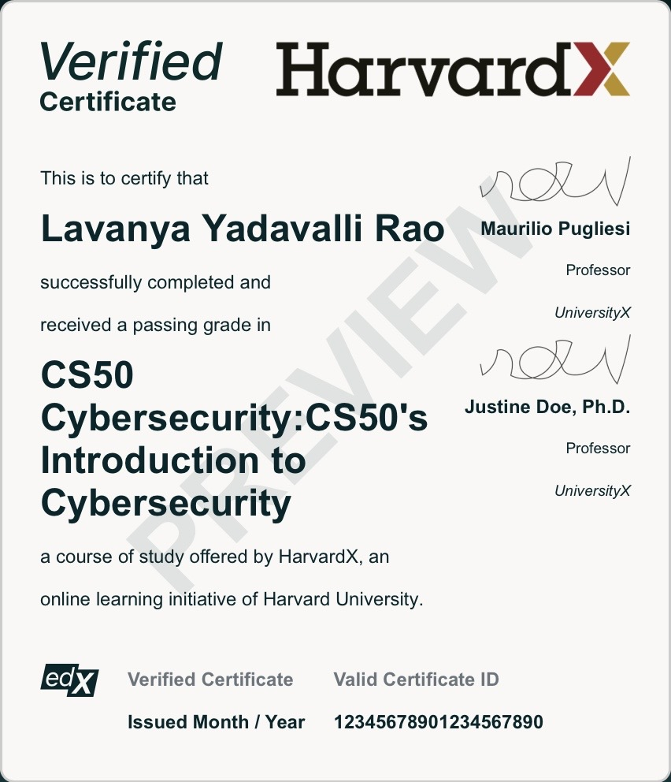

# Cybersecurity-Projects-Harvard
Cybersecurity projects and practical exercises demonstrating knowledge of networking, security concepts, and basic ethical hacking techniques.
## Certificate


## 🧠 Skills Demonstrated
- 🔐 Password Security & Validation  
- 🧠 Understanding of Brute Force Attacks  
- ⚙️ Python Scripting for Cybersecurity  
- 🛡️ Basic Ethical Hacking Concepts  

---

## Projects

### 🔐 Password Strength Checker (Python)

A simple cybersecurity tool that checks whether a password is strong or weak based on security rules.

**Features:**
- ✅ Minimum length check (8+ characters)
- ✅ Detects uppercase and lowercase letters
- ✅ Checks for numbers
- ✅ Checks for special characters
- ✅ Uses regex (pattern matching)

**Tech Used:**
- Python
- Regular Expressions (re module)

**Example Output:**
```text
Enter password: Hello123
Weak: add special character

Enter password: Hello@123
Strong password
```

---

### 🔐 Password Generator (Python)

A cybersecurity tool that generates strong and random passwords.

**Features:**
- Generates secure random passwords
- Includes uppercase, lowercase, numbers, and symbols
- Custom password length

**Tech Used:**
- Python
- Random module
- String module

---

### 🧠 Login Brute Force Simulator (Python)

A basic cybersecurity simulation that demonstrates how brute force attacks try multiple passwords to gain access.

**Features:**
- Simulates multiple login attempts
- Demonstrates brute force attack logic
- Shows success and failure attempts

**Tech Used:**
- Python
- Time module

---

### 🌐 Network Scanner (Python)

A basic cybersecurity tool that scans a target system to identify open ports.

**Features:**
- 🔍 Scans ports 1–1024
- 🌐 Supports IP address and domain input
- ⚡ Detects open ports

**Tech Used:**
- Python
- Socket module

**Example Output:**
```text
Enter target IP or domain: google.com

Scanning target: 142.250.xxx.xxx
Scanning ports 1–1024...

Port 80: OPEN
Port 443: OPEN

Scanning complete.
```

---

### 🌐 Network Scanner (Advanced - Multithreaded)

A high-performance cybersecurity tool that scans a target system using multithreading for faster results.

**Features:**
- ⚡ Multithreaded port scanning
- 🔍 Scans ports 1–1024
- 🌐 Supports both IP address and domain input
- 🚀 Faster and more efficient than basic scanner

**Tech Used:**
- Python
- Socket module
- Threading module
